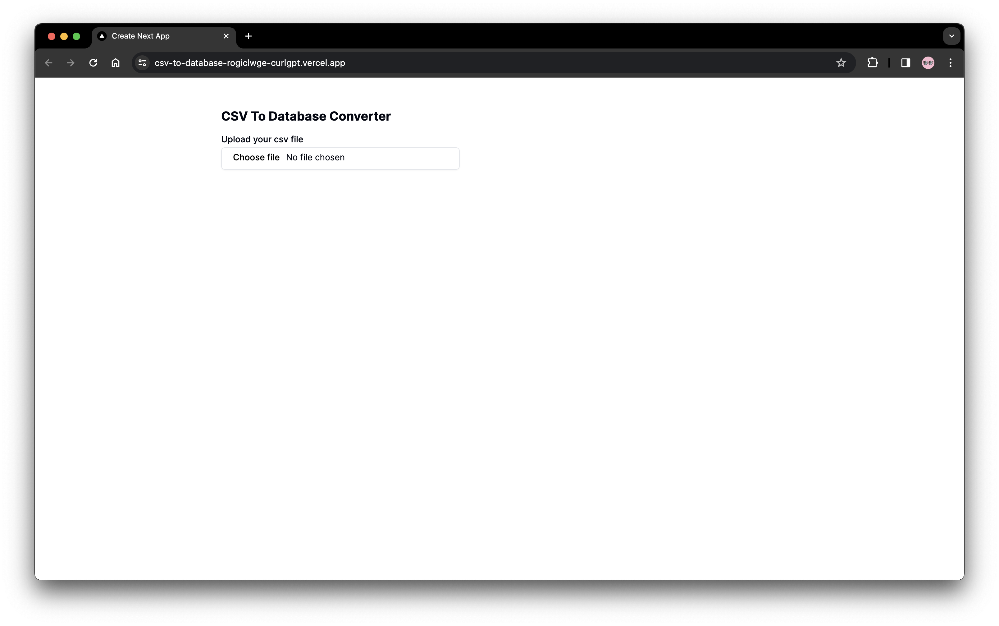
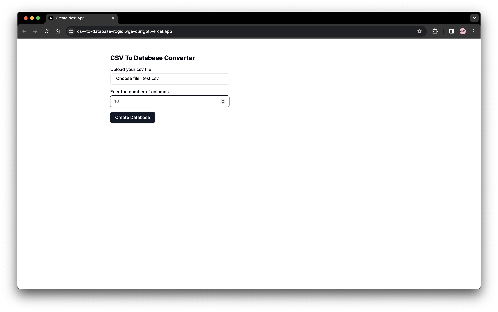
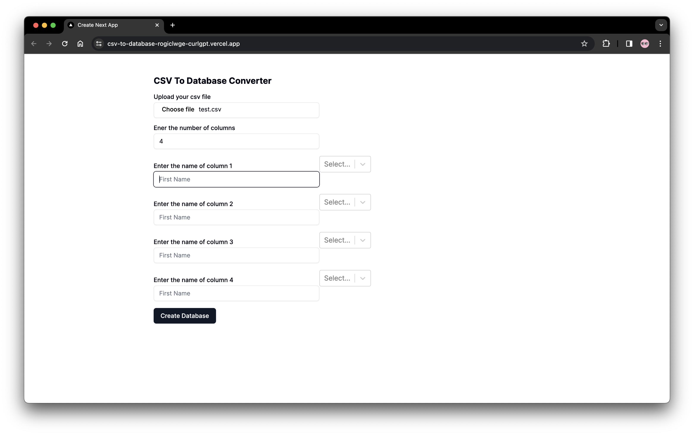
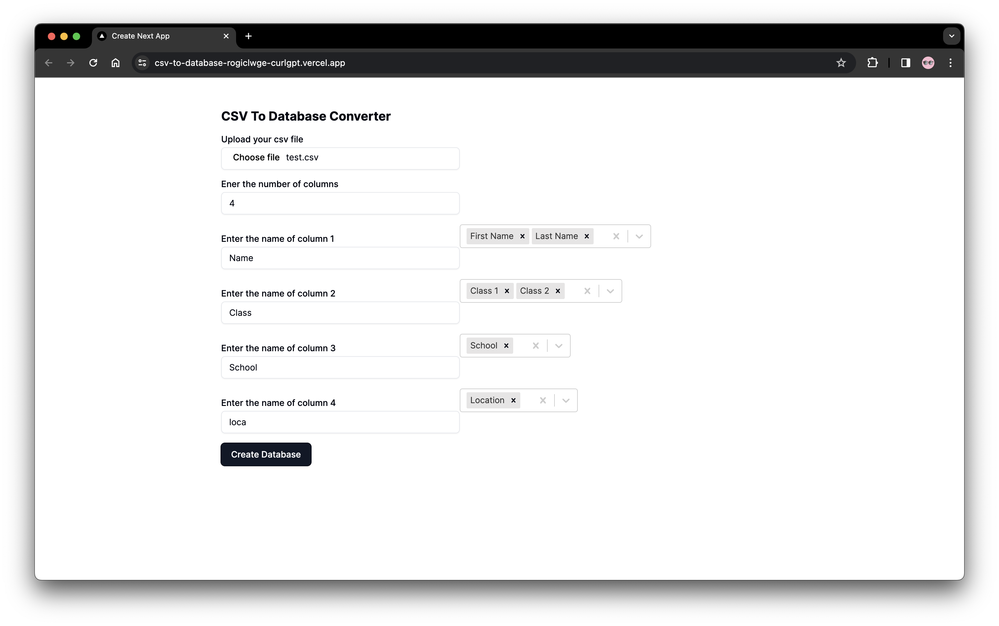
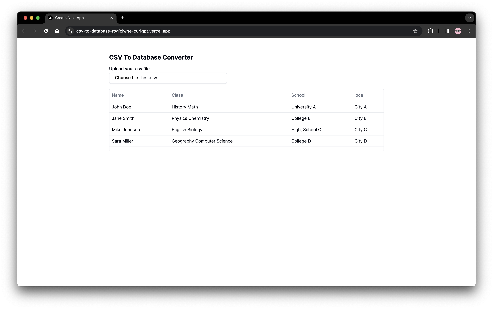

# CSV-to-Database Tool

**Welcome to the [CSV-to-Database Tool](https://csv-to-database.vercel.app/)**, a user-friendly No Code solution designed for non-technical individuals to effortlessly convert CSV files into SQL Databases Table within seconds. 🚀

## Features:

1. **CSV to SQL Conversion:** Seamlessly transform CSV file into SQL Database Table with just a few clicks. 🔄

2. **Column Merging:** Merge two or more columns into a single cohesive dataset. 📊

## Tech Stack:

This tool is built using [Next.js](https://nextjs.org/), ensuring a modern and efficient web application. 💻

## How to Use:

Follow these simple steps to convert your CSV file to an SQL Database Table (You can find a test.csv file under `test-data` folder):

1. Visit the [CSV-to-Database Tool](https://csv-to-database-rogiclwge-curlgpt.vercel.app/).

2. Upload your CSV file to the application. 📂
   

3. Specify the number of columns you desire in the resulting SQL Table. 🔢
   

4. For each column, provide a name and select the source column(s) whose values you want to populate in the new SQL Table column.

    > Note: Multiple source columns can be chosen from the dropdown menu. 🔄

    

5. Click the **Create Database** button. 🚀
   

6. Voila! Your SQL Table is ready, populated with data from your CSV file. 🎉
   

### Example:

Suppose you have a CSV with columns A, B, and C. You want to create an SQL Table with two columns - "ID" and "MergedData," where "MergedData" contains values from both columns B and C. Here's how you would set it up:

-   Number of Columns: 2
-   Column 1:
    -   Name: ID
    -   Source Column: Select "A" from the dropdown menu.
-   Column 2:
    -   Name: MergedData
    -   Source Columns: Select both "B" and "C" from the dropdown menu.

Enjoy the simplicity and speed of converting your CSV data into a structured SQL Database! 🚀📊
